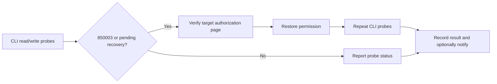

# wecom-auth-keeper

**Detect and recover expiring WeCom CLI business permissions on macOS.**

A recovery path for reports, spreadsheet synchronization and agent workflows interrupted by seven-day permission expiry.

[](https://github.com/fyaic/wecom-auth-keeper/actions/workflows/repository-checks.yml)


[](LICENSE)

[简体中文](README.md) · **English**

[Quick start](#quick-start) · [Commands](#commands) · [Validation](#validation) · [Documentation](#documentation) · [Contributing](CONTRIBUTING.md)

## Why this exists

**A refreshed access token does not mean a bot's business permissions are still valid.** In our WeCom deployment, document read and write permissions have independent seven-day authorization periods. Continued API use does not extend them; expired operations return `850003`.

wecom-auth-keeper uses an existing macOS WeCom session to inspect permissions, interact with the official authorization UI and verify recovery through CLI probes. Its native Accessibility adapter is included; no bridge source checkout is required.

- **Visible failures:** separate document read/write probes, structured JSON and nonzero failure exits.
- **Verified targets:** bot identity checks before actions; incomplete or ambiguous page states stop the operation.
- **Recoverable interruptions:** process locks, atomic state, a pending-recovery journal and optional deduplicated notifications.

> [!IMPORTANT]
> Experimental operations tool. A logged-in, interactive Mac must remain available. The standalone script has renewed document read/write and contacts permissions on a live account. Full navigation, business API checks and multi-cycle acceptance remain outstanding. See [Validation](#validation).

## Quick start

**Requirements:** macOS, Python 3.11+, a logged-in WeCom desktop client, and `wecom-cli` already authorized for the target bot. Desktop actions require macOS Accessibility permission.

### 1. Install

```bash
git clone https://github.com/fyaic/wecom-auth-keeper.git
cd wecom-auth-keeper
python3 -m venv .venv
.venv/bin/python -m pip install -r requirements-macos.txt
cp config.example.json config.json
```

### 2. Configure locally

Edit `config.json` using the [setup guide](docs/getting-started.md): set the target bot identifiers, probe spreadsheet IDs and the absolute path to this repository's `.venv/bin/python3`. CLI credentials must belong to the same bot.

**The write probe overwrites cell A1 in the configured test sheet. Use a dedicated test spreadsheet.** Optional bridge link delivery, notifications and monitor coordination are disabled by default.

### 3. Check your setup and permissions

```bash
# Local configuration/platform/dependency checks; no GUI access
.venv/bin/python renew.py --config config.json --doctor

# First open the target bot's permissions page in WeCom
.venv/bin/python renew.py --config config.json --check --existing-window
```

`--check` does not grant/revoke permissions, send messages or change monitor mode. It writes local state and reports healthy only when page identity and complete permission states can be verified.

## Commands

Run from the repository directory. Operational results are JSON; see the [setup guide](docs/getting-started.md) for exit codes and migration details.

| Purpose | Command |
|---|---|
| Probe read/write operations, writing to the dedicated test sheet | `.venv/bin/python probe.py --config config.json` |
| Recover expired permissions | `.venv/bin/python renew.py --config config.json --renew` |
| Probe, recover and verify | `.venv/bin/python keepalive.py --config config.json` |
| Experimental pre-expiry renewal for permissions due within 24 hours | `.venv/bin/python renew.py --config config.json --pre-renew --existing-window --within-hours 24` |

Expired-permission recovery can reuse an open permissions page or click a visible target authorization link in the current chat. **Pre-expiry renewal requires an already-open target page with the relevant controls visible.** Automatic management-list navigation and scrolling are not implemented. Revocation and re-granting create a temporary permission gap.

After verifying a single run, follow the [setup guide](docs/getting-started.md) to install an hourly launchd job. Scheduling and business retries do not guarantee zero downtime.

## How it works



GUI authorization and API availability are separate checks. Keepalive requires both renewal and read/write probes to pass. Network and other API failures are reported without blindly triggering GUI authorization.

## Validation

| Evidence | Confirmed | Not established |
|---|---|---|
| Original production implementation | Author-reported recovery on Sep 14 and Sep 21; the latter took 38s and 78s for the two permission lines | Reliability of the new implementation or success across accounts |
| Sep 21 live desktop-agent session | Pre-expiry revoke/re-grant extended both document permissions by seven days; verified after reopening the page | Live reauthorization by the new standalone code |
| Current automated regression suite | State classification, identity checks, interrupted recovery, process boundaries and native AX geometry; Linux/macOS CI | Full GUI navigation, live business operations or multi-cycle acceptance |

Read the [evidence](docs/validation.md), [known limitations](docs/known-limitations.md) and [acceptance roadmap](docs/roadmap.md). The seven-day behavior is an observation, not a platform guarantee for every capability, account or future version.

## Documentation

Detailed operational guides are currently in Chinese. English documentation contributions are welcome.

| Guide | Contents |
|---|---|
| [Setup](docs/getting-started.md) | Configuration, commands, pending recovery, scheduling and exit codes |
| [Authorization model](docs/auth-model.md) | Token vs. capability authorization, historical observations and troubleshooting |
| [Validation](docs/validation.md) | Live results and their scope |
| [Known limitations](docs/known-limitations.md) | Current boundaries and migration notes |
| [Roadmap](docs/roadmap.md) | Next work and acceptance criteria |
| [Changelog](CHANGELOG.md) | Behavior and compatibility changes |

## Development and contributions

Regression tests do not need a real account. With native dependencies installed on macOS, they also exercise AX value conversion.

```bash
.venv/bin/python scripts/check_repository.py
.venv/bin/python -m unittest discover -s tests -v
```

Help with **reliable navigation, client compatibility reports, live acceptance of the new implementation and multi-cycle validation**. Read [Contributing](CONTRIBUTING.md), use the [issue templates](https://github.com/fyaic/wecom-auth-keeper/issues/new/choose) for sanitized reproductions, and follow the [security policy](SECURITY.md) for sensitive reports.

## Background and license

This project grew out of permission failures in unattended WeCom document workflows. Upstream context: [WeCom CLI #87](https://github.com/WecomTeam/wecom-cli/issues/87) and [#134](https://github.com/WecomTeam/wecom-cli/issues/134). Community maintained, not affiliated with Tencent or WeCom, and not an official renewal API.

[MIT License](LICENSE) © 2026 fyaic

### Selecting permissions

Set `target_rows` to exact capability labels, for example:

```json
"target_rows": ["新建与编辑文档", "搜索与获取文档内容", "搜索企业成员"]
```

Only listed rows are operated on. Use only `搜索与获取文档内容` for document read access. This is a configuration whitelist, not a checkbox UI. An available grant button may also represent a never-granted permission: list only capabilities you intend to authorize. Keepalive business probes currently cover document read/write; contacts validation checks UI status and expiry.
