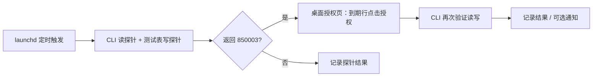

# wecom-auth-keeper

**让企业微信自动化，在七天能力授权到期后继续工作。**

[English](README.en.md) · [部署指南](docs/getting-started.md) · [实机验证](docs/validation.md) · [路线图](docs/roadmap.md) · [参与贡献](CONTRIBUTING.md)


[](LICENSE)


企业微信 `wecom-cli` 的访问 token 可以自动刷新，但成员授予机器人的**业务能力授权**会单独到期。我们观察到文档读、写各有独立的七天周期，持续调用也不会延长有效期。后台报表、表格同步和 Agent 任务可能因此中断。

wecom-auth-keeper 使用 macOS 企业微信桌面端的已有登录会话，检测授权失效并操作官方授权界面。项目不提供官方续期 API，也不会消除平台的七天授权规则。

> **当前是实验性运维工具。** 仓库脚本实现到期后的续期；未到期时“取消授权 → 重新授权”已完成实机桌面自动化验证，尚未封装为独立定时脚本。需要常驻、已登录且可操作的 macOS 桌面。

## 已经验证了什么？

| 能力 | 状态 | 证据 |
|---|---|---|
| CLI 文档读写双探针 | 已实现；作者报告生产运行 | [授权模型与历史](docs/auth-model.md) |
| 到期后点击授权并复探 | 已实现；作者报告真实恢复 | [验证记录](docs/validation.md) |
| 未到期时取消再授权 | **实机复现成功**；未集成进 `renew.py` | [预续期验证](docs/validation.md) |
| 新机器独立安装、多周期无人值守 | 待完成 | [验收路线图](docs/roadmap.md) |

2026-09-21，对一个目标机器人的既有权限执行桌面自动化，文档读取有效期从 **9/22 18:01 → 9/28 16:36**，写入从 **9/22 18:01 → 9/28 16:39**。关闭权限页后重新打开，结果一致，全程没有扫码或人工点击。此验证由桌面代理完成，不能据此声称当前仓库脚本已支持预续期。

## 工作方式



预续期的已验证路径：**机器人聊天标题 → 去管理 → 管理列表 → 目标机器人详情 → 可使用权限 → 已授权下拉 → 取消授权 → 授权**。取消期间存在短暂未授权窗口，需要上层业务协调或重试。

## 开始使用

```bash
git clone https://github.com/fyaic/wecom-auth-keeper.git
cd wecom-auth-keeper
cp config.example.json config.json
```

接着按[部署指南](docs/getting-started.md)配置目标机器人、专用探针表格及 `wecom-bridge` 的 Python 环境。当前核心代码依赖外部 bridge 的 AX helpers；只有 PyObjC 不足以运行。

**`--check` 会打开桌面页面，并可能发送链接消息、切换 bridge monitor 模式及写状态文件。它不是纯只读命令。** 配置 `bridge_send_link=false` 可关闭链接投递，但仍需目标聊天中已有可见的授权链接。

无需企业微信或凭据即可执行仓库结构检查：

```bash
python3 scripts/check_repository.py
```

该检查覆盖 Python/Bash 语法、配置模板、plist 和本地文档链接，不证明 GUI 续期功能正常。

## 使用前了解

- 适合愿意维护一台常驻 Mac 的 `wecom-cli` 自动化项目。当前不支持 Linux/Windows 的桌面续期。
- CLI 写探针会覆盖指定测试表的首个单元格；请使用专用测试表。
- 当前核心脚本存在状态误判、退出码和失败告警等已知问题，详见[已知限制](docs/known-limitations.md)。不要只凭 `ok=true` 判定业务恢复。
- 到期、授权主体、客户端版本和界面结构都可能影响结果。七天周期是实测结论，不是本项目对平台未来行为的保证。

## 参与和交流

欢迎提交脱敏的客户端兼容性报告、失败复现和代码改进。最需要的贡献是**稳定导航、严格状态判定、独立依赖封装与跨周期验证**，见[贡献指南](CONTRIBUTING.md)。

上游讨论：[授权有效期可观测性 #87](https://github.com/WecomTeam/wecom-cli/issues/87)、[文档读写权限分叉 #134](https://github.com/WecomTeam/wecom-cli/issues/134)。本项目由社区维护，与腾讯/企业微信无隶属关系。

[MIT License](LICENSE) © 2026 fyaic
