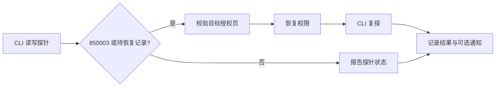

# wecom-auth-keeper

**企业微信七天能力授权的检测与恢复工具。**

让依赖 `wecom-cli` 的报表、表格同步和 Agent 工作流，在授权到期时有明确的恢复路径。

[](https://github.com/fyaic/wecom-auth-keeper/actions/workflows/repository-checks.yml)


[](LICENSE)

**简体中文** · [English](README.en.md)

[快速开始](#快速开始) · [命令参考](#命令参考) · [验证状态](#验证状态) · [临时续期方案](docs/workaround.md) · [完整文档](#完整文档) · [参与贡献](CONTRIBUTING.md)

## 为什么需要它

**访问 token 刷新成功，不代表业务能力授权仍然有效。** 在我们的企业微信场景中，文档读取与写入各有独立的七天授权周期；持续调用不会延长有效期，到期后接口返回 `850003`。

wecom-auth-keeper 使用已登录的 macOS 企业微信桌面会话，检测失效、操作官方授权页面，再通过 CLI 验证恢复结果。原生 Accessibility 适配层已内置，无需额外的 bridge 源码。

- **明确知道哪里失败**：分别检测文档读写能力，输出结构化 JSON 和非零失败退出码。
- **恢复前确认目标**：校验授权页中的机器人身份；页面不完整、身份不符或结果不明时停止操作。
- **为中断留下恢复路径**：进程锁、原子状态文件、预续期恢复记录，以及可选的去重通知。

> [!IMPORTANT]
> 当前为实验性运维工具，需要常驻、已登录且可操作的 Mac。新版独立脚本已完成文档读写、通讯录三项实机预续期；完整导航、业务 API 复探与跨周期运行仍待验收。详见[验证状态](#验证状态)。

## 快速开始

**前置条件：** macOS、Python 3.11+、已登录的企业微信，以及已完成目标 bot 授权的 `wecom-cli`。桌面操作需要 macOS 辅助功能权限。

### 1. 安装

```bash
git clone https://github.com/fyaic/wecom-auth-keeper.git
cd wecom-auth-keeper
python3 -m venv .venv
.venv/bin/python -m pip install -r requirements-macos.txt
cp config.example.json config.json
```

### 2. 填写本地配置

按[部署指南](docs/getting-started.md)编辑 `config.json`，填写目标机器人身份、探针表格，以及本仓库 `.venv/bin/python3` 的绝对路径。CLI 凭据应属于同一 bot。

**写探针会覆盖指定测试子表的 A1 单元格，请使用专用测试表。** bridge 仅用于可选的链接投递、通知和 monitor 协调，默认关闭。

### 3. 检查环境与权限

```bash
# 只检查本地配置、平台与依赖，不操作 GUI
.venv/bin/python renew.py --config config.json --doctor

# 在企业微信中打开目标 bot 的“可使用权限”页后检查
.venv/bin/python renew.py --config config.json --check --existing-window
```

`--check` 不改授权、不发消息、不改 monitor，但会写本地状态。只有能确认页面身份及完整权限状态时才返回健康结果。

## 命令参考

以下命令均在仓库目录执行。运行结果为 JSON；[退出码与迁移说明](docs/getting-started.md#命令与退出码)见部署指南。

| 目的 | 命令 |
|---|---|
| 检测文档读写能力，写入专用测试表 | `.venv/bin/python probe.py --config config.json` |
| 恢复已到期权限 | `.venv/bin/python renew.py --config config.json --renew` |
| 完整保活：探测 → 恢复 → 复探 | `.venv/bin/python keepalive.py --config config.json` |
| 实验性预续期：处理 24 小时内到期的权限 | `.venv/bin/python renew.py --config config.json --pre-renew --existing-window --within-hours 24` |

到期恢复可复用已打开的权限页，或点击当前聊天中可见的目标授权链接。**预续期要求提前打开目标权限页**；脚本会将目标控件滚动到可见位置，管理列表自动导航尚未实现。取消与重授之间会有短暂未授权窗口。

确认单次运行符合预期后，可按[部署指南](docs/getting-started.md#每小时保活)安装每小时 launchd 任务。该任务执行到期后恢复，不会自动执行 `--pre-renew`。调度和业务重试无法保证零中断。

## 工作方式



GUI 显示成功和实际 API 可用是两层验证。保活要求恢复命令与读写复探同时通过；网络或其他 API 错误会报告失败，不盲目触发授权操作。

### 只续期指定权限

在配置文件中使用 `target_rows` 白名单，填写页面上的能力行名称。例如只续期文档读写和通讯录：

```json
"target_rows": ["新建与编辑文档", "搜索与获取文档内容", "搜索企业成员"]
```

未列出的权限不会被操作。只需要文档读取时，可只保留 `搜索与获取文档内容`。这不是界面勾选器：需要编辑配置；页面上的“授权”也可能表示从未授权，请只填写你确实希望授予机器人的能力。`keepalive.py` 当前业务探针仅覆盖文档读写，通讯录续期验证的是页面状态和有效期。

## 验证状态

| 证据 | 已确认 | 未覆盖 |
|---|---|---|
| 原版本生产记录 | 作者报告 9/14、9/21 到期恢复成功；9/21 两线恢复耗时 38 秒、78 秒 | 新版实现的可靠性、跨账号成功率 |
| 9/21 桌面代理实测 | 未到期文档读写权限取消后重授，新有效期延至七天后；重开页面复核一致 | 新版独立代码的真实重授权 |
| 9/22 独立脚本实测 | 三项权限由 9/22 18:39 更新至 9/29 16:18，重开页面复核一致 | 业务 API 复探、完整导航、跨周期运行 |
| 当前自动化回归 | 状态判定、身份校验、中断恢复、进程入口与原生 AX 几何转换；Linux/macOS CI | 完整 GUI 导航、真实业务与跨周期验收 |

查看[完整验证记录](docs/validation.md)、[已知限制](docs/known-limitations.md)和[后续验收计划](docs/roadmap.md)。七天周期来自实测，不代表所有能力、账号或未来版本的平台契约。

## 完整文档

| 文档 | 内容 |
|---|---|
| [部署指南](docs/getting-started.md) | 配置、命令、预续期恢复、调度、退出码 |
| [官方支持核查](docs/official-status.md) | 2026-09-23 官方版本、源码、文档与 issue 状态 |
| [临时续期方案](docs/workaround.md) | 适用条件、最小复现、自动化边界与上游讨论 |
| [授权模型](docs/auth-model.md) | token 与能力授权的区别、历史取证和排障经验 |
| [验证记录](docs/validation.md) | 实机结果及其适用范围 |
| [已知限制](docs/known-limitations.md) | 当前边界与迁移注意事项 |
| [路线图](docs/roadmap.md) | 下一阶段工作及验收条件 |
| [变更记录](CHANGELOG.md) | 功能变化和兼容性说明 |

## 开发与贡献

不需要真实账号即可运行回归测试；macOS 安装原生依赖后还会执行 AX 值转换测试。

```bash
.venv/bin/python scripts/check_repository.py
.venv/bin/python -m unittest discover -s tests -v
```

欢迎贡献**稳定导航、客户端兼容性报告、外部实机复现与跨周期验证**。请先阅读[贡献指南](CONTRIBUTING.md)，通过 [Issue 模板](https://github.com/fyaic/wecom-auth-keeper/issues/new/choose)提供脱敏复现；敏感问题请遵循[安全报告说明](SECURITY.md)。

## 来源与许可

本项目起源于企业微信无人值守文档工作流的实际授权问题。上游讨论：[WeCom CLI #87](https://github.com/WecomTeam/wecom-cli/issues/87)、[#134](https://github.com/WecomTeam/wecom-cli/issues/134)。项目由社区维护，与腾讯/企业微信无隶属关系，不提供官方续期 API。

[MIT License](LICENSE) © 2026 fyaic
